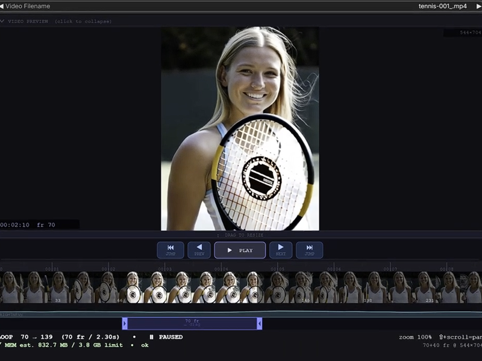
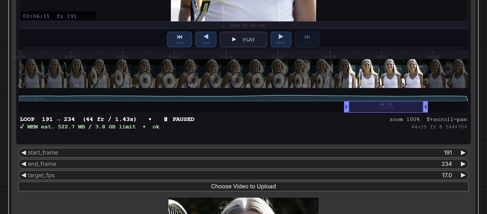
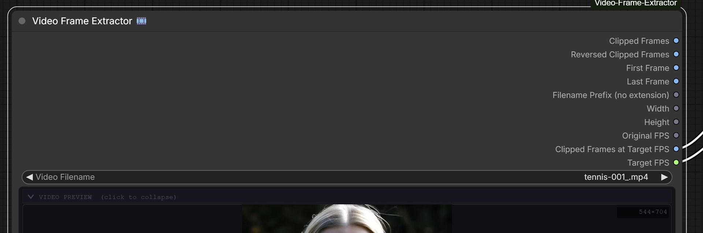

# ComfyUI Video Frame Extractor 🎞️

A ComfyUI custom node that brings a **DAW-style interactive video timeline** directly into the node graph. Upload any video, scrub through it in real time, drag a loop region to define your extraction window, and pipe the resulting frame batch into any downstream node.

[](https://ko-fi.com/L4L61XEMBR)

---

## Features


- **Interactive timeline** — filmstrip thumbnails with correct aspect ratio (including portrait video), brightness waveform, and a zoomable timecode ruler all rendered directly inside the node
- **Loop region selection** — drag the in/out handles or the region body to define start and end frames; the video preview seeks live as you drag
- **Resizable video preview** — drag the resize handle to make the preview pane as large as you need
- **Collapsible preview section** — hide the video preview to save canvas space while keeping the timeline accessible
- **Transport controls** — Play / Pause toggle, frame-step ◀ ▶ buttons, and ⏮ ⏭ Jump buttons that advance the loop window by its own span for stepping through non-overlapping clips
- **Live loading status** — progress bar, buffering percentage, elapsed time, and health indicators (stalled / error / timeout) shown while a video loads
- **Memory-safe execution** — live peak-memory estimate in the info bar updates as you adjust the loop region and `target_fps`; the backend refuses to run clips that would exceed available RAM, so ComfyUI never freezes on an oversized extraction
- **Zoom and pan** — scroll wheel to zoom the timeline, Shift + scroll to pan horizontally
- **Full outputs** — 10 output pins: forward frames, reversed frames, first and last frame, filename prefix, dimensions, original FPS, custom-FPS resampled frame batch, and target FPS passthrough

---

## Installation

### Via ComfyUI Manager _(recommended)_

1. Open **ComfyUI Manager → Custom Nodes → Search**
2. Search for `Video Frame Extractor`
3. Click **Install** and restart ComfyUI

### Manual

```bash
cd ComfyUI/custom_nodes
git clone https://github.com/comfyuiattic-989/ComfyUI-Video-Frame-Extractor
cd ComfyUI-Video-Frame-Extractor
pip install -r requirements.txt
```

Restart ComfyUI after installation.

---

## Requirements

| Package       | Version               |
| ------------- | --------------------- |
| Python        | ≥ 3.9                 |
| opencv-python | ≥ 4.7                 |
| Pillow        | ≥ 9.0                 |
| numpy         | ≥ 1.22                |
| psutil        | ≥ 5.9 (optional)      |
| torch         | (provided by ComfyUI) |

`psutil` is optional — when installed, the memory-safety check auto-tunes its limit to 75 % of your system's available RAM. Without it, the limit falls back to a fixed 8 GB.

---

## Usage

[](https://youtu.be/TWVsyQUB39s)

1. Place a video file in `ComfyUI/input/` or upload one directly via the **Choose Video to Upload** button on the node
2. Add the **Video Frame Extractor 🎞️** node to your graph _(right-click canvas → Add Node → video)_
3. Select your video from the dropdown — the timeline populates automatically
4. **Drag the indigo loop handles** to set the extraction window, or drag the loop body to pan the whole window
5. Connect the output pins to your workflow

### Timeline Controls



| Interaction            | Action                                                |
| ---------------------- | ----------------------------------------------------- |
| Drag loop handle (◀ ▶) | Resize the loop window                                |
| Drag loop body         | Slide the window without changing its span            |
| ▶ / ⏸ button           | Play or pause the preview within the loop             |
| ◀ / ▶ step buttons     | Shift the entire loop window one frame                |
| ⏮ / ⏭ jump buttons   | Jump the loop window backward/forward by its own span |
| Scroll wheel           | Zoom the timeline centred on the cursor               |
| Shift + scroll         | Pan the timeline left / right                         |
| Drag resize bar        | Adjust the height of the video preview                |
| Click collapse toggle  | Show / hide the video preview and transport           |

---

## Node Reference

### Inputs

| Name          | Type        | Description                                                                     |
| ------------- | ----------- | ------------------------------------------------------------------------------- |
| `video`       | File picker | MP4, AVI, MOV, MKV, or WebM file — upload via **Choose Video to Upload** button |
| `start_frame` | INT         | Loop region start (auto-set by timeline)                                        |
| `end_frame`   | INT         | Loop region end (auto-set by timeline)                                          |
| `num_frames`  | INT         | Auto-computed as end − start + 1; hidden on the node, synced internally         |
| `target_fps`  | FLOAT       | Target frame rate for the `Clipped Frames at Target FPS` output (default: 24.0) |

### Outputs



| Pin name                         | Type   | Description                                                                                          |
| -------------------------------- | ------ | ---------------------------------------------------------------------------------------------------- |
| `Clipped Frames`                 | IMAGE  | Batch of extracted frames, forward order `(N, H, W, 3)`                                              |
| `Reversed Clipped Frames`        | IMAGE  | Same batch in reverse order — useful for ping-pong effects                                           |
| `First Frame`                    | IMAGE  | Single frame at the loop start `(1, H, W, 3)`                                                        |
| `Last Frame`                     | IMAGE  | Single frame at the loop end `(1, H, W, 3)`                                                          |
| `Filename Prefix (no extension)` | STRING | Video filename without extension, e.g. `my_clip`                                                     |
| `Width`                          | INT    | Video width in pixels                                                                                |
| `Height`                         | INT    | Video height in pixels                                                                               |
| `Original FPS`                   | FLOAT  | Source frame rate of the video file                                                                  |
| `Clipped Frames at Target FPS`   | IMAGE  | Frame batch resampled to `target_fps` — count computed automatically from clip duration × target FPS |
| `Target FPS`                     | FLOAT  | Passes through the `target_fps` input value for use downstream                                       |

---

## Example Workflows

### Basic frame extraction

```
Video Frame Extractor → VAE Encode → KSampler
```

Feed a batch of video frames directly into a KSampler for video-to-video workflows.

### Ping-pong loop

```
Video Frame Extractor (frames) ──────────────→ ┐
                                               Batch Concat → Video Combine
Video Frame Extractor (frames_reversed) ──────→ ┘
```

Concatenate forward and reversed frame batches to create a seamless loop.

### Use filename as save prefix

```
Video Frame Extractor (filename_prefix) → Save Image (filename_prefix input)
```

Automatically name saved frames after the source video.

---

## Supported Formats

| Format      | Extension |
| ----------- | --------- |
| MP4 / H.264 | `.mp4`    |
| AVI         | `.avi`    |
| QuickTime   | `.mov`    |
| Matroska    | `.mkv`    |
| WebM        | `.webm`   |

Any format supported by your OpenCV build will also work.

---

## Changelog

### 1.0.0

- Initial release
- DAW-style timeline with filmstrip thumbnails and brightness waveform
- Loop region with drag handles and live video scrubbing
- Resizable / collapsible video preview
- Play / Pause toggle with frame-step buttons
- 8 output pins: `frames`, `frames_reversed`, `first_frame`, `last_frame`, `filename_prefix`, `width`, `height`, `fps`
- Zoom and pan on the timeline
- `start_frame` / `end_frame` spinners sync bidirectionally with the loop region

### 1.1.0

- Reduced video file opens from 6 → 2 per execution
- Halved peak memory during frame extraction by pre-allocating output buffer
- first_frame / last_frame now sliced from loaded batch instead of re-read from disk
- Fixed BytesIO buffer in thumbnail endpoint now explicitly closed after use

### 1.2.0

- Added `target_fps` input and `frames_at_fps` output — extracts a frame batch resampled to any target frame rate, independent of `num_frames`

### 1.3.0

- **Reliable video loading** — previous video is now fully stopped, unloaded, and its memory released before a new file begins loading; playing/looping videos no longer block new loads from completing
- **Loading progress bar** — the preview area shows a live progress bar (`Loading video… N%`) while the video buffers, an animated shimmer for indeterminate states (metadata fetch), and detailed status lines (elapsed time, buffered/total seconds, HTML5 `readyState`)
- **Load health indicators** — stalled downloads turn the bar amber with a "Stalled at N%" label; network errors, decode failures, and unsupported formats surface a red error overlay with the specific error reason; a 30-second watchdog flags videos that never become playable
- **Memory estimation & safety guard** — the info bar now shows a live peak-memory estimate (`✓ MEM est. X GB / Y GB limit`) that turns amber above 75% and red at the limit; the backend independently blocks execution with a clear `RuntimeError` before allocation to prevent ComfyUI from freezing on oversized clips. The limit adapts to 75 % of available system RAM when `psutil` is installed, falling back to 8 GB otherwise
- **Single-output execution fix** — the node is now marked `OUTPUT_NODE = True`, so workflows that only connect one pin (e.g. just `Clipped Frames at Target FPS`) no longer fail with "Prompt has no outputs"
- **Jump buttons** — ⏮ **JUMP BACK** and ⏭ **JUMP FWD** added to the transport bar; each press shifts the loop window by its own span so you can step through non-overlapping clips; buttons dim and disable when no full jump fits in that direction
- **Dynamic filmstrip height** — the filmstrip now scales its height based on the actual video aspect ratio so portrait footage is no longer squished; thumbnails also use the real aspect ratio instead of assuming 16:9
- **Improved info bar** — loop summary text is now larger (bold 13 px), white, and easier to read at a glance; a second row shows the memory estimate and the `N+M fr @ WxH` frame breakdown
- **Cleaner output labels** — all 10 output pins renamed to plain English: `Clipped Frames`, `Reversed Clipped Frames`, `First Frame`, `Last Frame`, `Filename Prefix (no extension)`, `Width`, `Height`, `Original FPS`, `Clipped Frames at Target FPS`, `Target FPS`
- **Target FPS output** — added a 10th output pin that passes through the `target_fps` input value for use downstream
- **Upload button label** — renamed from "choose file to upload" to "Choose Video to Upload"
- **Hidden num_frames widget** — the auto-computed `num_frames` field is no longer shown on the node; its value is still synced internally so the backend receives the correct frame count

---

## License

[MIT](LICENSE) © 2026

[](https://ko-fi.com/L4L61XEMBR)
